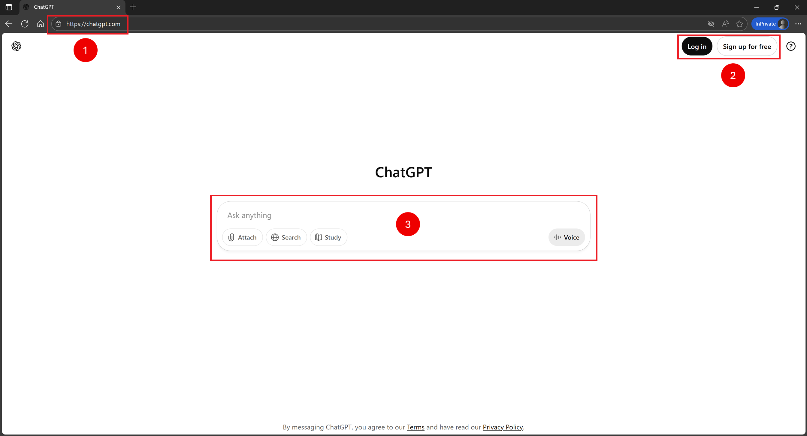
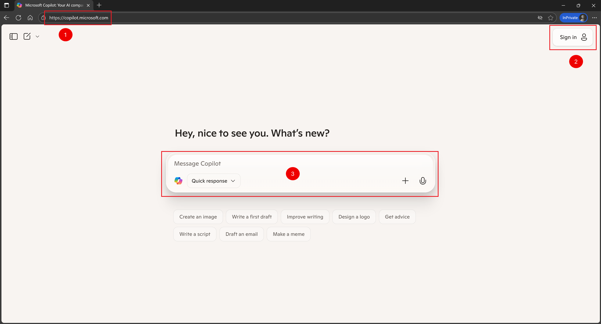

# Getting Started With AI Tools (ChatGPT & Microsoft Copilot)

## 1. Prerequisites
- Modern browser (Edge, Chrome, Firefox, Safari, or Chromium-based).
- Optional: Account (Microsoft account for Copilot, OpenAI account for ChatGPT).

## 2. Accessing the Sites
1. Open preferred browser mentioned in the prerequisites.
2. Navigate to chosen AI tool URL.
4. (Optional) Sign in or create an account.
5. Locate the message box.

- ChatGPT: https://chat.openai.com or https://chatgpt.com

    

- Microsoft Copilot (web): https://copilot.microsoft.com

    

6. Type a clear prompt or question and press Enter (or click Send).
7. Review response; refine or ask follow‑ups.
8. Use conversation history (if signed in) to revisit answers.

## 4. Writing an Effective First Prompt
- Be specific: “Summarize this paragraph for grade 8 level.”
- Provide context: “You are helping prepare a lesson on ecosystems.”
- Define format: “Return a bullet list of 5 key points.”
- Iterate: Refine after each reply.

## 5. Benefits: Signed In vs Not Signed In

| Aspect | Not Signed In (Guest) | Signed In |
|--------|-----------------------|-----------|
| Access stability | Session may reset | Persistent history |
| Conversation history | Usually lost on tab close | Saved & resumable |
| Personalization | None | Adapts to previous context |
| Rate limits | Stricter | Higher allowance |
| Advanced features | Often restricted | Broader (files, plugins, integrations) |
| Device sync | No | Yes across devices |
| Data control | Minimal settings | Account-level privacy controls |

## 6. Privacy & Safety Basics
- Avoid entering sensitive personal data.
- Verify factual or legal claims independently.
- Cite original sources for educational material.

## 7. When to Refresh or Reset
- Model seems “stuck” or off-topic.
- Large context shifts (start a new chat).
- Response limit reached (wait or clear).

## 8. Quick Troubleshooting
- Page not loading: Hard refresh (Ctrl+F5 / Cmd+Shift+R).
- Stale output: Rephrase prompt; add context.
- Long or cut reply: Ask “Continue” or “Summarize instead.”

## 9. Example Starter Prompts
- “Explain supervised vs unsupervised learning for a beginner.”
- “Create 5 discussion questions about renewable energy for high school.”
- “Rewrite this paragraph in simpler language: …”
- “List pros and cons of using AI-generated lesson materials.”

## 10. Next Steps
- Experiment with prompt styles (role + task + context + format).
- Compare answers between tools for completeness.
- Build a personal prompt library.

## 11. Minimal Prompt Template
Role: “You are an assistant helping educators.”
Task: “Generate a concise summary.”
Context: “Topic: photosynthesis basics.”
Format: “Return bullet list of 5 points.”

Combine:
“You are an assistant helping educators. Generate a concise summary. Topic: photosynthesis basics. Return bullet list of 5 points.”

## 12. Safe Classroom Use Tips
- Use AI for drafting, not final grading decisions.
- Encourage students to fact-check and cite sources.
- Discuss academic integrity (AI as support, not replacement).

Ready to explore: pick one tool, sign in for persistence, start with a structured prompt, iterate.

## Let's practice using prompts

### Create Unit or Learning Objectives
https://www.aiforeducation.io/prompts/learning-objectives

### Create a Lesson Plan
https://www.aiforeducation.io/prompts/lesson-plans

### Personalize quizzes
https://www.aiforeducation.io/prompts/personalize-quizzes

### Student assessments
https://www.aiforeducation.io/prompts/ai-assisted-assessments

### Writing assignments
https://www.aiforeducation.io/prompts/in-class-writing-assignments
