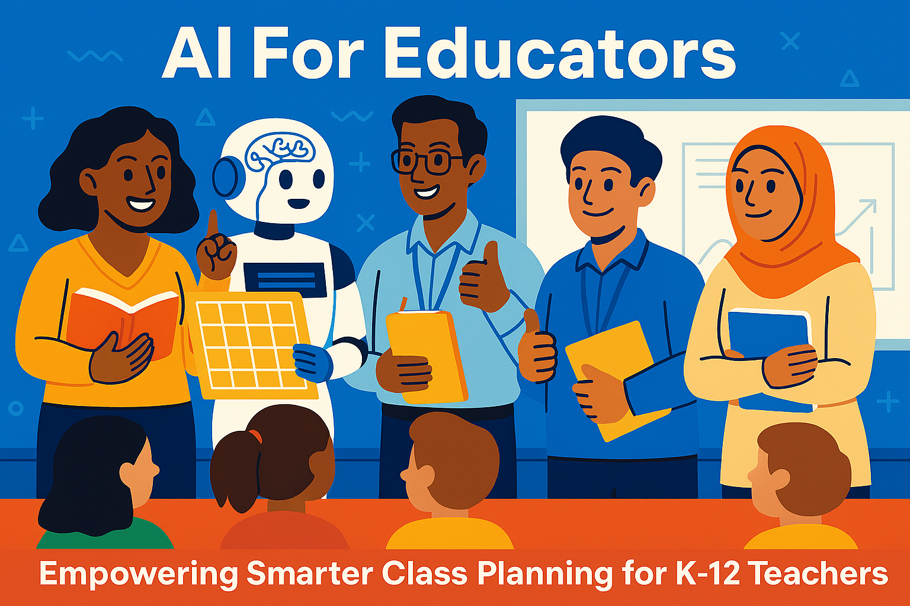

# AI for Educators

## Workshop Overview

The AI for Educators workshop gives K–12 teachers a concise, practical introduction to applying Artificial Intelligence in everyday teaching. Participants explore core AI concepts (classification, generative models, responsible use) and apply them through guided labs.

### What Teachers Do
- Practice prompting and refining outputs to support lesson and unit planning.
- Use AI tools to differentiate materials for varied reading levels and learning styles.
- Generate formative and summative assessment items (quizzes, rubrics, reflection prompts) responsibly.
- Analyze sample (anonymized) student work artifacts to explore AI‑assisted insight into learning progress.
- Experiment with simple data-driven progress tracking (e.g., spotting patterns, drafting progress reports).
- Create classroom-ready activity templates leveraging AI while reinforcing academic integrity.

### Key Outcomes
- Clear mental model of where AI meaningfully augments (not replaces) teacher expertise.
- A reusable prompt library for planning, differentiation, feedback, and evaluation.
- Practical guardrails: privacy, bias awareness, transparency with students, and appropriate attribution.
- An implementation checklist to pilot AI-supported workflows after the workshop.

### Format
Short concept bursts → live demos → hands-on lab sprints → reflection & share-out. Each lab produces artifacts teachers can adapt immediately for their classrooms.

### Prerequisites
Basic computer use; no prior coding required. Devices with browser access recommended.

### Takeaways
Participants leave with actionable lesson planning aids, assessment exemplars, ethical guidelines, and a roadmap for incremental AI adoption aligned to student learning goals.
